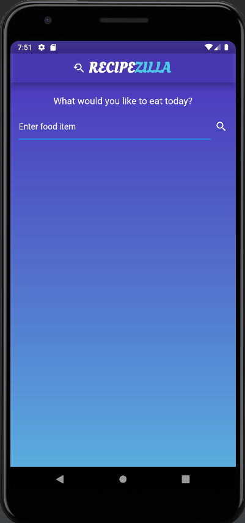
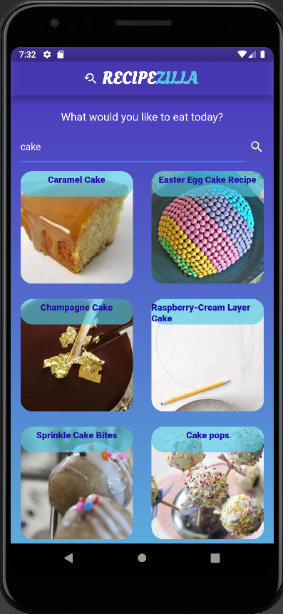
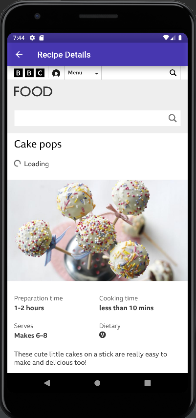
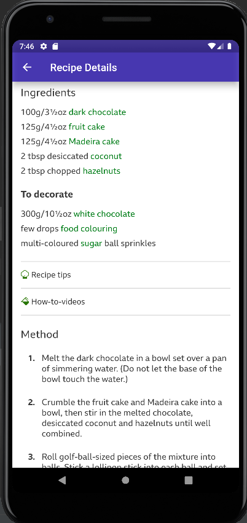

# RecipeZilla 🍽️

## <a name="system">About the App</a>

**RecipeZilla** is a search based recipe app. A list of recipes are displayed based on the user input, these recipes are fetched from an API. Then the user can view in detailed recipe of any food item of their choice from the list provided. This app is developed using Flutter/Dart.

(**Recipe API Used :** https://developer.edamam.com/edamam-recipe-api)

---

## <a name="Results">Results</a>

<table style="width:1600px; border: black; margin: 0px auto;" class="skinny" cellspacing="0" cellpadding="0">
    <tr>
        <th>Home Page</th>
        <th>Search Based List of Recipes</th>
    </tr> 
    <tr>
        <td>
            
        </td>
        <td>
            
        </td>
    </tr>
    <tr>
        <th>Recipe Details(a)</th>
        <th>Recipe Details(b)</th>
    </tr> 
    <tr>
        <td>
            
        </td>
        <td>
            
        </td>
    </tr> 
</table>

---